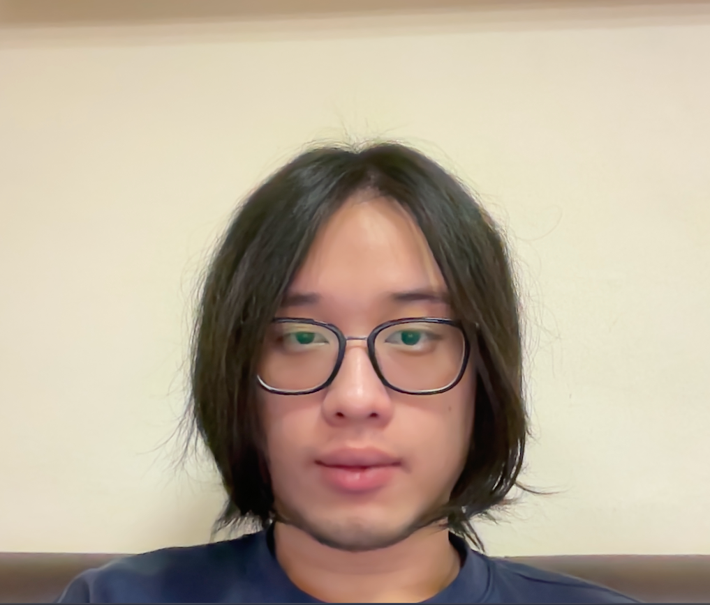
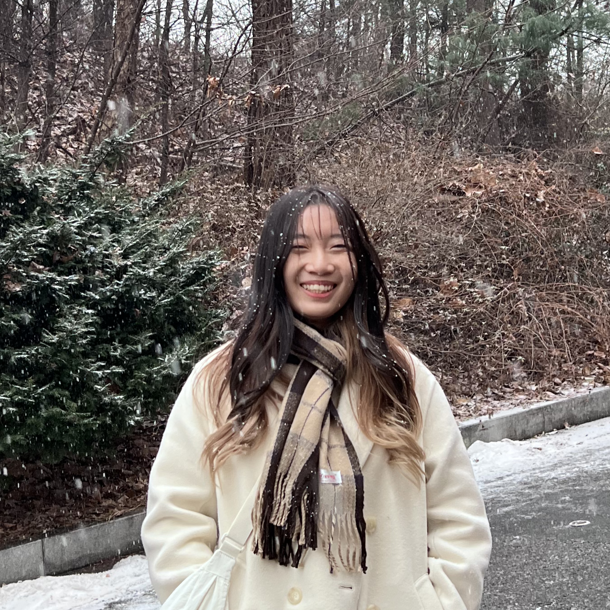

# About Us

We are a team based in the [School of Computing, National University of Singapore](http://www.comp.nus.edu.sg).

You can reach us at the email `seer[at]comp.nus.edu.sg`

## Project team

### Tan Xing Zhong

[[linkedin](https://www.linkedin.com/in/tan-xing-zhong-677492346/edit/forms/skills/new/?profileFormEntryPoint=PROFILE_SECTION)]
[[github](https://github.com/TanXingZhong)]
[[resume](https://drive.google.com/file/d/1WZkiFqrl-ZK3FwXPm555aZXWv69SyzfE/view?usp=sharing)]
[[portfolio](team/tanxingzhong.md)]

* Role: Leader
* Responsibilities: Deliverables and deadlines

### Michael Cheong

[[github](https://github.com/Reshiro)]
[[portfolio](team/reshiro.md)]

* Role: Testing

### Guan Qun

[[homepage](https://www.linkedin.com/in/tan-guan-qun-0417751b3/)]
[[github](https://github.com/monobeartae)]
[[portfolio](team/monobeartae.md)]

* Role: Integration

### Hai Hui

[[homepage](https://www.linkedin.com/in/hai-hui-lee-659160261/)]
[[github](https://github.com/iuhiah)]
[[portfolio](team/iuhiah.md)]

* Role: Documentation

### V Varsha

[[homepage](https://www.linkedin.com/in/varsha-v-561659214/)]
[[github](https://github.com/varsha13152)]
[[portfolio](team/varsha.md)]

* Role: Code Quality
