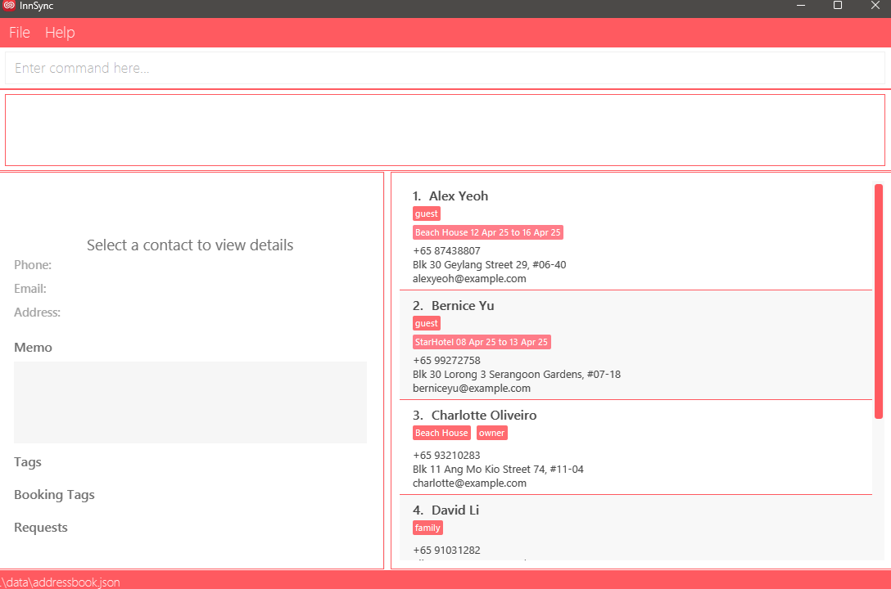
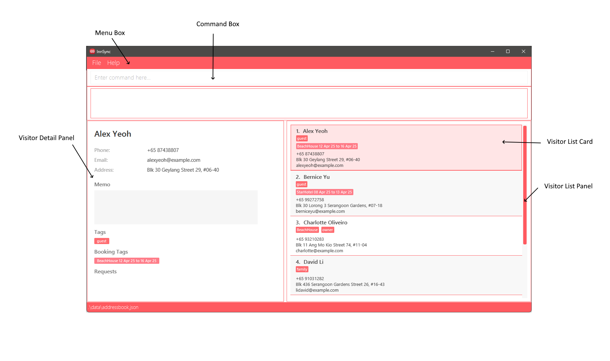
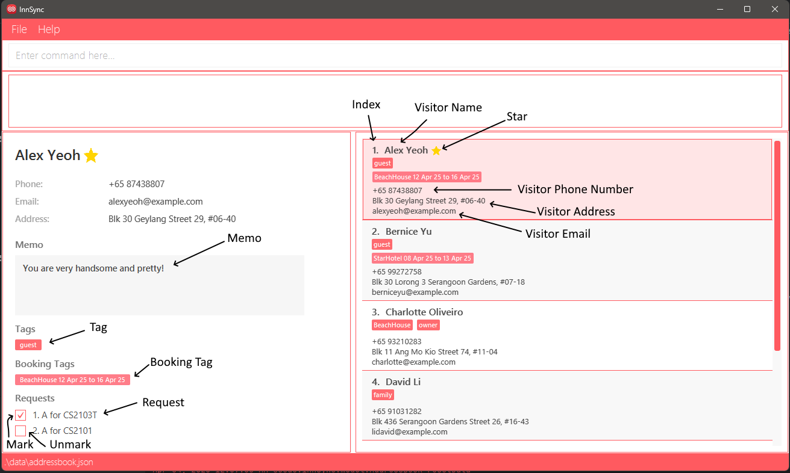

# InnSync User Guide

## Welcome to the InnSync User Guide

Welcome to the **InnSync User Guide** – your essential companion for managing contacts and visitor information
efficiently. Designed specifically for AirBnB owners.

In this comprehensive user guide, we will take you to experience a full journey with InnSync step by step.

--------------------------------------------------------------------------------------------------------------------

## Table of Contents

[1. Introduction](#1-introduction)
- [1.1 What is InnSync](#1-1-what-is-innsync)
- [1.2 User Proficiency and Expectations](#1-2-user-proficiency-and-expectations)
- [1.3 Why This Guide Matters](#1-3-why-this-guide-matters)

[2. How to use this User Guide](#2-how-to-use-this-user-guide)
- [2.1 Navigating the Document](#2-1-navigating-the-document)
- [2.2 Sections](#2-2-sections)

[3. Quick start](#3-quick-start)
- [3.1 Installation](#3-1-installation)
- [3.2 Graphical User Interface Layout](#3-2-graphical-user-interface-layout)
  - [3.2.1 User Interface Overview](#3-2-1-user-interface-overview)
  - [3.2.2 Additional UI Components](#3-2-2-other-ui-components)
- [3.3 How to use InnSync features](#3-3-how-to-use-innsync-features)
  - [3.3.1 Parameter Prefixes](#3-3-1-parameter-prefixes)
  - [3.3.2 Parameters](#3-3-2-parameters)
  - [3.3.3 Command Format](#3-3-3-command-format)

[4. Features](#4-features)
- [4.1 Command Summary](#4-1-command-summary)
- [4.2 Features related to visitor](#4-2-features-related-to-visitor)
  - [4.2.1 Adding a visitor](#4-2-1-adding-a-visitor-add)
  - [4.2.2 Editing a visitor](#4-2-2-editing-a-visitor-edit)
  - [4.2.3 Listing all visitor](#4-2-3-listing-all-visitors-list)
  - [4.2.4 Deleting a visitor](#4-2-4-deleting-a-visitor-delete)
- [4.3 Features related to star a visitor](#4-3-features-related-to-star-a-visitor)
  - [4.3.1 Star a visitor](#4-3-1-star-a-visitor-star)
  - [4.3.2 Unstar a visitor](#4-3-2-unstar-a-visitor-unstar)
  - [4.3.4 Listing all starred visitors](#4-3-3-listing-all-starred-visitors-liststar)
- [4.4 Features related to tag a visitor](#4-4-features-related-to-tag-a-visitor)
  - [4.4.1 Adding a booking tag](#4-4-1-adding-a-booking-tag-tag)
  - [4.4.2 Adding a tag](#4-4-2-adding-a-tag)
  - [4.4.3 Untagging a booking tag](#4-4-3-untagging-a-booking-tag-untag)
  - [4.4.4 Untagging a tag](#4-4-4-untagging-a-tag-untag)
- [4.5 Features related to request](#4-5-features-related-to-request)
  - [4.5.1 Adding a request](#4-5-1-adding-a-request-req)
  - [4.5.2 Marking a request](#4-5-2-marking-a-request-mark)
  - [4.5.3 Unmarking a request](#4-5-3-unmarking-a-request-unmark)
  - [4.5.4 Deleting a request](#4-5-4-deleting-a-request-deletereq)
- [4.6 Features related to finding](#4-6-features-related-to-finding)
  - [4.6.1 Locating visitors](#4-6-1-locating-visitors-find)
- [4.7 General features](#4-7-general-features)
  - [4.7.1 Clear all visitors](#4-7-1-clear-all-visitors-clear)
  - [4.7.2 Exit the program](#4-7-2-exit-the-program-exit)
  - [4.7.3 Undo the last command](#4-7-3-undo-the-last-command-undo)
  - [4.7.4 Help](#4-7-4-help)

[5. FAQ](#5-faq)

[6. Known issues](#6-known-issues)

[7. Glossary](#7-glossary)

--------------------------------------------------------------------------------------------------------------------

## 1. Introduction

### 1.1 What is InnSync

InnSync is a desktop application designed specifically for managing contacts for AirBnB owners,
optimized for use via a **Command Line Interface** (CLI) while still having the benefits of a
**Graphical User Interface** (GUI). If you can type fast, InnSync can get your contact management
tasks done faster than traditional GUI apps.

Key Features:
* Contact & Visitor Management: Add, edit, and delete contacts with ease.
* Rapid Command Execution: Quickly execute commands using a straightforward CLI.
* Automatic Data Persistence: Your changes are saved automatically to ensure all visitor details remain current.

### 1.2 User Proficiency and Expectations
* Technical Skills: InnSync is designed for users with basic command line experience and familiarity with
  file navigation.

* Efficiency: Built for AirBnB owners, the tool prioritizes quick, streamlined workflows to manage visitor and
  contact information.

* User-Friendly: Whether you're new to command line tools or an experienced user, InnSync’s design caters
  to a broad range of technical proficiencies.

### 1.3 Why This Guide Matters
This guide is crafted to help you fully leverage InnSync’s features. As an AirBnB owner, managing visitor details
quickly and accurately is vital. This guide provides clear instructions, examples, and troubleshooting tips so
you can optimize your workflow and focus on delivering a great visitor experience.

--------------------------------------------------------------------------------------------------------------------

## 2. How to use this User Guide
This section explains how to navigate the guide and locate the information you need.

### 2.1 Navigating the Document:
* __Table of Contents:__ Use the Table of Contents at the start to jump directly to sections relevant to your needs.
* __Section Organization:__ The guide is divided into clear sections such as Introduction, Quick Start, Features, FAQ, Known Issues, and Command Summary.

### 2.2 Sections:
* [Installation](#3-1-installation): Step-by-step setup instructions for InnSync.
* [Features](#4-features): Detailed breakdown of each command with usage examples.
* [FAQ & Known Issues](#5-faq): Solutions to common questions and troubleshooting tips.
* [Command Summary](#4-1-command-summary): A quick-reference table for all available commands.


<box type="info" seamless>
First-time users are strongly encouraged to read the Quick Start section before beginning to use InnSync.
</box>

--------------------------------------------------------------------------------------------------------------------

## 3. Quick start

### 3.1 Installation

1. Ensure you have Java `17` or above installed on your Computer.<br>
   **Mac users:** Ensure you have the precise JDK version prescribed [here](https://se-education.org/guides/tutorials/javaInstallationMac.html).

2. Download the latest `.jar` file from [here](https://github.com/AY2425S2-CS2103T-T16-2/tp/releases).

3. Copy the file to the folder you want to use as the _home folder_ for InnSync.

4. Open your command terminal, depending on what OS you use follow the instruction below.
* Windows: Tutorial on how to open a terminal [here.](https://learn.microsoft.com/en-us/windows/terminal/faq)
* MacOS:Tutorial on how to open a terminal [here.](https://support.apple.com/en-sg/guide/terminal/apd5265185d-f365-44cb-8b09-71a064a42125/mac)
* Linux: Tutorial on how to open a terminal [here.](https://ubuntu.com/tutorials/command-line-for-beginners#1-overview)

5.  Navigate to the folder by using `cd` into the folder you put the jar file in, and use the `java -jar innsync.jar` command to run the application.<br>

6. A GUI similar to the below should appear in a few seconds. Note how the app contains some sample data.<br><br>
   


7. Type the command in the command box and press Enter to execute it. e.g. typing **`help`** and pressing Enter will open the help window.<br>
   Some example commands you can try:

* `list` : Lists all contacts.

* `add n/John Doe p/+65 98765432 e/johnd@example.com a/John street, block 123, #01-01` : Adds a contact named `John Doe` to the Address Book.

* `delete 3` : Deletes the 3rd contact shown in the current list.

* `clear` : Deletes all contacts.

* `exit` : Exits the app.

8. Refer to the [Features](#features) below for details of each command.

### 3.2 Graphical User Interface Layout:

#### 3.2.1 User Interface Overview:

* __Menu Box:__ The menu bar, located at the top of the interface, provides access to various functions and features within InnSync.
* __Command Box:__ This section allows users to enter commands for InnSync to execute.
* __Result Box:__ The box shows the results of executed commands at the interface.
* __Visitor List Panel:__ This panel visually represents the list of visitor in InnSync.
* __Visitor List Card:__ Within the Visitor List Panel, each visitor is depicted with their details displayed in card format.
* __Visitor Detail Panel:__ This panel visually represents the selected visitor in InnSync.

#### 3.2.2 Other UI Components:

* __Index:__ This component displays the position of each visitor in the Visitor List Panel.
* __Visitor Name:__ The Name is displayed in both the Visitor Detail and Visitor List Panel, which represent the name of the visitor.
* __Visitor Phone Number:__ The contact number associated with the visitor.
* __Visitor Address:__ The physical location or residence of the visitor, which may be used for record-keeping.
* __Visitor Email:__ The email address of the visitor.
* __Star:__ The visitor was starred.
* __Memo:__ A free-text field for storing additional notes or important details about the visitor.
* __Tag:__ Label assigned to a visitor to tag them based on anything.
* __Booking Tag:__ Labels related to the visitor's booking, the dates are represented with ```dd-MMM-yy format```, but inputted with ```yyyy-MM-dd```.
* __Request:__ Special accommodations or preferences requested by the visitor where the user records it.
* __Mark:__ Denote the completion of said request by the user.
* __Unmark:__ Denote the request as not completed.
* __Selected Visitor:__ Highlighted in pink, this component indicates the selected Visitor Detail Panel for viewing.

### 3.3 How to use InnSync features:
InnSync operates mainly through CLI commands. Before exploring to the specific features in details under
the feature section. Let's try to familiarize ourselves with the basic components and formats to execute a command.
> **Tip:** All the command words are case-sensitive!
>
> * `add` is different from `Add`

#### 3.3.1 Parameter Prefixes:

In InnSync, a parameter prefix acts as a delimiter for specifying different types of parameters in commands.
Here's a reference table for parameter prefixes and their corresponding parameters:

| Parameter Prefix | Corresponding Parameter  |
|------------------|--------------------------|
| `n/`             | `NAME`                   |
| `p/`             | `PHONE`                  |
| `e/`             | `EMAIL`                  |
| `a/`             | `ADDRESS`                |
| `b/`             | `BOOKING_TAG`            |
| `bp/`            | `BOOKING_PROPERTY`       |
| `bd/`            | `BOOKING_DATE`           |
| `t/`             | `TAG`                    |
| `r/`             | `REQUEST`                |
| `r/`             | `REQUEST_INDEX`          |
| `m/`             | `MEMO`                   |

#### 3.3.2 Parameters:

In InnSync, a parameter represents a placeholder where users input data.
Parameters typically follow immediately after their corresponding Parameter Prefixes.
Essentially, they are to be supplied by the user.

**Note:** All user inputs, including parameters, will be trimmed (all leading and trailing whitespaces will be ignored).

| Parameter          | Prefix   | Description                                                                                                                                                                                                                                                                                                                                                                                                                                                                                                                                                                                                                                                                                                                                                                                                                                                                                                                                                                                                                                                                   |
|--------------------|----------|-------------------------------------------------------------------------------------------------------------------------------------------------------------------------------------------------------------------------------------------------------------------------------------------------------------------------------------------------------------------------------------------------------------------------------------------------------------------------------------------------------------------------------------------------------------------------------------------------------------------------------------------------------------------------------------------------------------------------------------------------------------------------------------------------------------------------------------------------------------------------------------------------------------------------------------------------------------------------------------------------------------------------------------------------------------------------------|
| `NAME`             | `n/`     | Specifies the name of a visitor.<br><br>**Requirements:**<ul></li><li>Names cannot be empty.</li><li>Names cannot exceed 170 characters.</li><li>Names with only whitespace are not allowed.</li><li>In this system, names can contain any characters except ```$```, including prefixes like ```a/``` or ```e/```. However, names containing prefixes, such as ```murthu a/p vara``` must be preceded by a ```$``` to avoid the prefix being interpreted as one.<li> **For example:**<ul><li>```n/Muthu a/p vara``` → Name: Muthu, Address: p vara <li>```n/Muthu $a/p vara``` → Name: Muthu a/p vara (entire string is parsed as the name, and ```$a/p``` is ignored as a prefix) <li>The ```$``` is used to prevent the parser from treating the following string as a prefix — it tells the parser "don't treat this as a field, treat it as part of the value."</ul><li>You are unable to add names containing ```$```, as it is used for the purpose mentioned above. All ```$``` characters found in name parameters will be excluded from the contact's display name. |
| `PHONE`            | `p/`     | Specifies the phone number of a visitor.<br><br>**Requirements:** <ul><li>Phone numbers should be in the format `+[COUNTRY_CODE] [NUMBER]`.</li><li>Country code should be a valid country code.</li><li>Country code should be 1-3 digits long.</li><li>Number should be 7-15 digits long.</li><li>Phone number cannot be empty.</ul>                                                                                                                                                                                                                                                                                                                                                                                                                                                                                                                                                                                                                                                                                                                                        |
| `EMAIL`            | `e/`     | Specifies the email of a visitor.<br><br>**Requirements:** <ul><li>Emails should be of the format `local-part@domain`.</li><li>Emails cannot be empty.</li><li>Local-part should contain only alphanumeric characters and special characters.</li><li>Domain must follow standard domain name rules with proper labels separated by periods.</li></ul>                                                                                                                                                                                                                                                                                                                                                                                                                                                                                                                                                                                                                                                                                                                        |
| `ADDRESS`          | `a/`     | Specifies the address of a visitor.<br><br>**Requirements:**<ul><li>Addresses can take any values.</li><li>Addresses cannot be empty.</li><li>Addresses cannot exceed 500 characters.</li></ul>                                                                                                                                                                                                                                                                                                                                                                                                                                                                                                                                                                                                                                                                                                                                                                                                                                                                               |
| `BOOKING_TAG`      | `b/`     | Specifies the booking tag of a visitor.<br><br> **Requirements:** <ul><li>Booking tags must be in the format: `PROPERTY from/START_DATE to/END_DATE`.</li><li>`PROPERTY` cannot be empty.</li><li>`PROPERTY` cannot exceed 170 characters.</li><li>`START_DATE` and `END_DATE` cannot be empty.</li><li>`START_DATE` and `END_DATE` must follow the format `yyyy-MM-dd`.</li><li>`START_DATE` and `END_DATE` must be valid dates.</li><li>`START_DATE` must be before `END_DATE`.</li></ul>                                                                                                                                                                                                                                                                                                                                                                                                                                                                                                                                                                                   |
| `BOOKING_PROPERTY` | `bp/`    | Specifies the booking property of a visitor for the feature ```find```.<br><br> **Requirements:** <ul><li>Booking properties can take any values.</li><li>Booking property cannot be empty.</ul>                                                                                                                                                                                                                                                                                                                                                                                                                                                                                                                                                                                                                                                                                                                                                                                                                                                                              |
| `BOOKING_DATE`     | `bd/`    | Specifies the booking date of a visitor for the feature ```find```.<br><br> **Requirements:** <ul><li>Booking dates must be in the format `yyyy-MM-dd`.</li><li>Booking date cannot be empty.</ul>                                                                                                                                                                                                                                                                                                                                                                                                                                                                                                                                                                                                                                                                                                                                                                                                                                                                            |
| `TAG`              | `t/`     | Specifies the tag name of a visitor.<br><br> **Requirements:** <ul><li>Tags can take any values.</li><li>Tags cannot be empty.</li><li>Tags cannot exceed 170 characters.</li></ul>                                                                                                                                                                                                                                                                                                                                                                                                                                                                                                                                                                                                                                                                                                                                                                                                                                                                                           |
| `REQUEST`          | `r/`     | Specifies the request of a visitor.<br><br> **Requirements:** <ul><li>Requests can take any values.</li><li>Requests cannot be empty.</li><li>Requests cannot exceed 170 characters.</li></ul>                                                                                                                                                                                                                                                                                                                                                                                                                                                                                                                                                                                                                                                                                                                                                                                                                                                                                |
| `REQUEST_INDEX`    | `r/`     | Refers to the index number shown in the Request panel.<br><br> **Requirements:** <ul><li>Must be a positive integer.</li><li>The value must fall within the valid range (1 to number of requests in the list).</li><li>Request index must also be less than or equal to ```2147483647```</ul>                                                                                                                                                                                                                                                                                                                                                                                                                                                                                                                                                                                                                                                                                                                                                                                 |
| `MEMO`             | `m/`     | Specifies the memo of a visitor.<br><br> **Requirements:** <ul><li>Memos can take any values.</li><li>Memos cannot be empty.</li><li>Memos cannot not exceed 500 characters.</li></ul>                                                                                                                                                                                                                                                                                                                                                                                                                                                                                                                                                                                                                                                                                                                                                                                                                                                                                        |
| `INDEX`            | N/A      | Refers to the index number shown in the List Panel.<br><br> **Requirements:** <ul><li>Must be a positive integer.</li><li>The value must fall within the valid range (1 to number of visitors in the list).</li><li>Index must also be less than or equal to ```2147483647```.</ul>                                                                                                                                                                                                                                                                                                                                                                                                                                                                                                                                                                                                                                                                                                                                                                                           |

#### 3.3.3 Command Format:

To understand how a full command is interpreted, we will utilise the following example.

**Example:** `add n/NAME p/PHONE e/EMAIL a/ADDRESS [t/TAG...] [b/BOOKING_TAG...] [r/REQUEST...]`
>**Tip:** You can add a visitor without specifying a tag, booking tag and request and that is why it has a bracket around it!

**Structure of Command:**<br>

|         | Component        | Description                                            |
|---------|------------------|--------------------------------------------------------|
| `add`   | Command          | Executes Add Command to add a visitor.                 |
| `n/`    | Parameter Prefix | Unique prefix to distinguish `NAME` from other prefix. |
| `NAME`  | Parameter        | Represents placeholder for name of the visitor.        |

**General Notes about InnSync:**<br>

> **A command can be categorized into three formats:**
> 1. `COMMAND` + `INDEX`
> 2. `COMMAND` + `PARAMETER_PREFIX` + `PARAMETER`
> 3. `COMMAND` + `INDEX` + `PARAMETER_PREFIX` + `PARAMETER`

<box type="info" seamless>

**Notes about the command format:**<br>

* Words in `UPPER_CASE` are the parameters to be supplied by the user.<br>
e.g. in `add n/NAME`, `NAME` is a parameter which can be used as `add n/John Doe`.

* Items in square brackets are optional.<br>
e.g `n/NAME [t/TAG]` can be used as `n/John Doe t/friend` or as `n/John Doe`.

* Items with `...`​ after them can be used multiple times including zero times.<br>
e.g. `[t/TAG...]` can be used as ` `&nbsp;(i.e. 0 times), `t/friend`, `t/friend t/family` etc.

* Parameters can be in any order.<br>
e.g. if the command specifies `n/NAME p/PHONE_NUMBER`, then `p/PHONE_NUMBER n/NAME` is also acceptable.

* Extraneous parameters for commands that do not take in parameters (such as `help`, `list`, `exit` and `clear`) will be ignored.<br>
e.g. if the command specifies `help 123`, it will be interpreted as `help`.

* If you are using a PDF version of this document, be careful when copying and pasting commands that span multiple lines as space characters surrounding line-breaks may be omitted when copied over to the application.
</box>

--------------------------------------------------------------------------------------------------------------------

## 4. Features
## 4.1 Command Summary

| Action                    | Format, Examples                                                                                                                                                                                    |
|---------------------------|-----------------------------------------------------------------------------------------------------------------------------------------------------------------------------------------------------|
| **Add Visitor**           | `add n/NAME p/PHONE_NUMBER e/EMAIL a/ADDRESS [t/TAG...] [b/BOOKING_TAG...] [r/REQUEST...]` <br> e.g., `add n/James Ho p/+82 22224444 e/jamesho@example.com a/123, Clementi Rd, 1234665 t/friend`    |
| **Edit Visitor**          | `edit INDEX [n/NAME] [p/PHONE_NUMBER] [e/EMAIL] [a/ADDRESS] [t/TAG...] [b/BOOKING_TAG...] [r/REQUEST...]`​ <br> e.g.,`edit 2 n/James Lee e/jameslee@example.com`                                    |
| **List Visitor**          | `list`                                                                                                                                                                                              |
| **Delete Visitor**        | `delete INDEX` <br> e.g., `delete 3`                                                                                                                                                                |
| **Star Visitor**          | `star INDEX` <br> e.g., `star 1`                                                                                                                                                                    |
| **Unstar Visitor**        | `unstar INDEX` <br> e.g., `unstar 1`                                                                                                                                                                |
| **List Starred Visitors** | `liststar`                                                                                                                                                                                          |
| **Tag Visitor**           | `tag INDEX t/TAG [t/TAG...]​` <br> e.g., `tag 1 t/friend` or <br> `tag INDEX b/PROPERTY from/yyyy-MM-dd to/yyyy-MM-dd [b/BOOKING_TAG...]​` <br> e.g., `tag 1 b/Hotel from/2025-10-10 to/2025-10-11` |
| **Untag Visitor**         | `untag INDEX t/TAG` <br> e.g., `untag 1 t/friend` or <br> `untag INDEX b/PROPERTY from/START_DATE to/END_DATE` <br> e.g., `untag 1 b/Hotel from/2025-10-10 to/2025-10-11`                           |
| **Add Request**           | `req INDEX r/REQUEST [r/REQUEST...​]` <br> e.g., `req 1 r/a request`                                                                                                                                |
| **Mark Request**          | `mark INDEX r/REQUEST_INDEX` <br> e.g., `mark 1 r/1`                                                                                                                                                |
| **Unmark Request**        | `unmark INDEX r/REQUEST_INDEX` <br> e.g., `unmark 1 r/1`                                                                                                                                            |
| **Delete Request**        | `deletereq INDEX r/REQUEST_INDEX` <br> e.g. `deletereq 1 r/1`                                                                                                                                       |
| **Memo Visitor**          | `memo INDEX m/[MEMO]` <br> e.g., `memo 1 m/cool`                                                                                                                                                    |
| **Find**                  | `find [n/KEYWORD...] [p/KEYWORD...] [e/KEYWORD...] [a/KEYWORD] [t/KEYWORD...] [bp/KEYWORD...] [bd/KEYWORD...] [m/KEYWORD...]e.g., find n/john p/879294`                                             |
| **Clear**                 | `clear`                                                                                                                                                                                             |
| **Exit**                  | `exit`                                                                                                                                                                                              |
| **Undo**                  | `undo`                                                                                                                                                                                              |
| **Help**                  | `help`                                                                                                                                                                                              |

## 4.2 Features related to visitor

### 4.2.1 Adding a visitor: `add`

Adds a visitor to the address book.

Format: `add n/NAME p/PHONE_NUMBER e/EMAIL a/ADDRESS [t/TAG...] [b/BOOKING_TAG...] [r/REQUEST...] [m/MEMO]`

<box type="Tip" seamless>

**Tip:** A visitor can have any number of tags or requests (including 0) and at most one memo.

**Tip:** If a visitor's name contains a prefix e.g. ```/```, escape the prefix with ```$```.
e.g. To add a visitor with the name "murthu a/p", use the command `add n/murthu $a/p [...]`.
</box>

**Note:** New visitors added will be sorted alphabetically.

Examples:
* `add n/John Doe p/+65 98765432 e/johnd@example.com a/John street, block 123, #01-01`
* `add n/Betsy Crowe t/friend e/betsycrowe@example.com a/Newgate Prison p/+65 1234567 t/criminal t/offence r/cool r/beans m/handsome`

### 4.2.2 Editing a visitor : `edit`

Edits an existing visitor in the address book.

Format: `edit INDEX [n/NAME] [p/PHONE] [e/EMAIL] [a/ADDRESS] [b/BOOKING_TAG...]​ [t/TAG...]​ [r/REQUEST...] [m/MEMO]`

* Edits the visitor specified by `INDEX`. The index refers to the index number shown in the displayed visitor list. The index **must be a positive integer**.
* At least one of the optional fields must be provided.
* Existing values will be updated to the input values.
* When editing tags, the existing tags of the visitor will be removed i.e adding of tags is not cumulative.
* You can remove all the visitor’s tags by typing `t/` without specifying any tags after it.
* You can remove all the visitor’s booking tags by typing `b/` without specifying any tags after it.
* You can remove all the visitor’s requests by typing `r/` without specifying any booking tags after it.
* You can remove the visitor’s memo by typing `m/` without specifying any memo after it.

<box type="Tip" seamless>

**Tip:** To edit a visitor's name to contain a prefix, escape the prefix with ```$```.
e.g. To change the name of the first contact in the list to "murthu a/p", use the command `edit 1 n/murthu $a/p [...]`.

</box>

Examples:
*  `edit 1 p/+65 91234567 e/johndoe@example.com` Edits the phone number and email address of the 1st visitor to be `+65 91234567` and `johndoe@example.com` respectively.
*  `edit 2 n/Betsy Crower t/` Edits the name of the 2nd visitor to be `Betsy Crower` and clears all existing tags.
*  `edit 2 n/Betsy Crower b/` Edits the name of the 2nd visitor to be `Betsy Crower` and clears all existing booking tags.
*  `edit 2 n/Betsy Crower r/` Edits the name of the 2nd visitor to be `Betsy Crower` and clears all existing requests.
*  `edit 2 n/Betsy Crower m/` Edits the name of the 2nd visitor to be `Betsy Crower` and clears memo.

### 4.2.3 Listing all visitors : `list`

Shows a list of all visitors in the address book.

Format: `list`

**Tip:** Listing without any visitors added will recommend you to add some.

### 4.2.4 Deleting a visitor : `delete`

Deletes the specified visitor from the address book.

Format: `delete INDEX`
* Deletes the visitor specified by `INDEX`. The index refers to the index number shown in the displayed visitor list. The index **must be a positive integer**.

Examples:
* `list` followed by `delete 2` deletes the 2nd visitor in the address book.
* `find Betsy` followed by `delete 1` deletes the 1st visitor in the results of the `find` command.

## 4.3 Features related to star a visitor

### 4.3.1 Star a visitor : `star`

Stars a visitor in the address book.

Format: `star INDEX`

* The index refers to the index number shown in the displayed visitor list. The index **must be a positive integer**.

### 4.3.2 Unstar a visitor : `unstar`

Unstar a starred visitor in the address book.

Format: `unstar INDEX`

* The index refers to the index number shown in the displayed visitor list. The index **must be a positive integer**.

### 4.3.3 Listing all starred visitors : `liststar`

Shows a list of all starred visitors in the address book.

Format: `liststar`

## 4.4 Features related to tag a visitor

### 4.4.1 Adding a booking tag : `tag`

Adds a booking tag into the visitor in the address book.

Format: `tag INDEX b/PROPERTY from/START_DATE to/END_DATE`

* Adds the booking tag to the visitor specified by `INDEX`. The index refers to the index number shown in the displayed visitor list. The index **must be a positive integer**.
* All the fields must be provided.
* The date format has to match `yyyy-MM-dd` exactly.
* If a booking tag has dates that overlap with any existing booking tags the visitor already has, the new booking tag will be rejected.

Examples:
* `tag 1 b/Hotel from/2025-10-10 to/2025-10-11` Adds the booking tag to the 1st visitor on the list.
* `tag 1 b/Hotel from/2025-10-10 to/2025-10-11` Adding the same booking tag again will be rejected due to overlapping dates.

### 4.4.2 Adding a tag : `tag`

Adds a tag into the visitor in the address book.

Format: `tag INDEX t/TAG`

* Adds the tag to the visitor specified by `INDEX`. The index refers to the index number shown in the displayed visitor list. The index **must be a positive integer**.
* All the fields must be provided.
* When adding a tag that does not exist in the visitor, the tag will be appended to the previous tags.
* When trying to add a tag that already exists in the visitor, the command will be rejected.

**Note:** Tags are case-sensitive, so ```friend``` is different from ```Friend```.

Examples:
* `tag 1 t/friend` Adds the tag to the 1st visitor on the list.
* `tag 1 t/friend` Adding the same tag again will be rejected due to duplicate tags.

### 4.4.3 Untagging a booking tag : `untag`

Removes a booking tag on the 1st visitor in the address book.

Format: `untag INDEX b/PROPERTY from/START_DATE to/END_DATE`

* Removes a booking tag to the visitor specified by `INDEX`. The index refers to the index number shown in the displayed visitor list. The index **must be a positive integer**.
* All the fields must be provided.
* The date format has to match `yyyy-MM-dd` exactly.
* When removing a booking tag that exists in the visitor, the booking tag will be removed.
* When trying to remove a booking tag that does not exist in the visitor, the command will be rejected.

Examples:
* `untag 1 b/Hotel from/2025-10-10 to/2025-10-11` Removes the booking tag with matching booking tag on the 1st visitor in the list if they exist.
* `untag 1 b/Hotel from/2025-10-10 to/2025-10-11` After running example above this line, it will throw an error saying this booking tag does not exist.

### 4.4.4 Untagging a tag : `untag`

Removes a tag on the 1st visitor in the address book.

Format: `untag INDEX t/TAG`

* Removes a tag to the visitor specified by `INDEX`. The index refers to the index number shown in the displayed visitor list. The index **must be a positive integer**
* All the fields must be provided.
* When removing a tag that exists in the visitor, the tag will be removed.
* When trying to remove a tag that does not exist in the visitor, the command will be rejected.

Examples:
* `untag 1 t/friend` Removes the tag with matching tag on the 1st visitor in the list if they exist.
* `untag 1 t/friend` After running example above this line, it will throw an error saying this tag does not exist.

## 4.5 Features related to request

### 4.5.1 Adding a request: `req`

Adds a request into the visitor in the address book.

Format: `req INDEX r/REQUEST`

* Adds the request to the visitor specified by `INDEX`. The index refers to the index number shown in the displayed visitor list. The index **must be a positive integer**.
* All the fields must be provided.
* When adding a request that does not exist in the visitor, the request will be appended to the previous requests.
* When trying to add a request that already exists in the visitor, the command will be rejected.

**Note:** Requests are case-sensitive, so ```want banana``` is different from ```want Banana```.

Examples:
* `req 1 r/Want banana` Adds the request to the 1st visitor on the list.
* `req 1 r/Want banana` Will be rejected due to duplicating request own by this visitor.

### 4.5.2 Marking a request: `mark`

Marks a request as completed for a specific visitor in the address book.

Format: `mark INDEX r/REQUEST_INDEX`

* Marks the request specified by `REQUEST_INDEX` for the visitor at `INDEX` as completed. The index refers to the index number shown in the displayed visitor list. The `INDEX` **must be a positive integer**. The request index refers to the index number of the request in the visitor's request list. The `REQUEST_INDEX` **must be a positive integer**.
* All the fields must be provided.
* When marking a request that exists in the visitor that is not yet marked, the request will be marked as completed.
* When marking a request that does not exist in the visitor, the command will be rejected.
* When trying to mark a request that is already marked, the command will be rejected.

Examples:
* `mark 1 r/1` Marks the first request of the first visitor on the list as completed if it exists.
* `mark 1 r/1` Marking again will be rejected.

### 4.5.3 Unmarking a request: `unmark`

Unmarks a previously marked request for a specific visitor in the address book.

Format: `unmark INDEX r/REQUEST_INDEX`

* Unmarks the request specified by `REQUEST_INDEX` for the visitor at `INDEX` as not completed. The index refers to the index number shown in the displayed visitor list. The `INDEX` **must be a positive integer**. The request index refers to the index number of the request in the visitor's request list. The `REQUEST_INDEX` **must be a positive integer**.
* All the fields must be provided.
* When unmarking a request that exists in the visitor that is marked, the request will be unmarked as not completed.
* When unmarking a request that does not exist in the visitor, the command will be rejected.
* When trying to unmark a request that is not marked, the command will be rejected.

Examples:
* `unmark 1 r/1` Unmarks the first request of the first visitor on the list as not completed if it exists.
* `unmark 1 r/1` Unmarking again will be rejected.

### 4.5.4 Deleting a request: `deletereq`

Deletes a request from a specific visitor in the address book.

Format: `deletereq INDEX r/REQUEST_INDEX`

* Deletes the request specified by `REQUEST_INDEX` for the visitor at `INDEX`. The index refers to the index number shown in the displayed visitor list. The `INDEX` **must be a positive integer**. The request index refers to the index number of the request in the visitor's request list. The `REQUEST_INDEX` **must be a positive integer**.
* All the fields must be provided.
* When deleting a request that exists in the visitor, the request will be removed from the visitor's request list.
* When deleting a request that does not exist in the visitor, the command will be rejected.

Examples:
* `deletereq 1 r/1` Deletes the first request of the first visitor on the list.
* `deletereq 1 r/1` Deleting again will be rejected.

## 4.6 Memo a visitor : `memo`

Adds a memo into the visitor in the address book.

Format: `memo INDEX m/MEMO`

* Adds a memo to the visitor specified by `INDEX`. The index refers to the index number shown in the displayed visitor LIST. The index **must be a positive integer**.
* All the fields must be provided.
* This command will overwrite the existing memo of the visitor if it exists.

Examples:
* `memo 1 m/recurring customer` Overwrites the memo of the 1st visitor on the list.

> **Tip:** You can remove a memo with `memo INDEX m/` intead of using the `edit` command!

## 4.6 Features related to finding

### 4.6.1 Locating visitors: `find`

Allows users to search for visitors whose details match the specified keywords.

Format: `find [n/KEYWORD...] [p/KEYWORD...] [e/KEYWORD...] [a/KEYWORD...] [bp/KEYWORD...]  [bd/DATE...][t/KEYWORD...] [m/KEYWORD...]`

* At least one prefix with a keyword must be provided.
* Searches are case-insensitive (e.g., `n/hans` will match `Hans`).
* Searches match by containment (e.g., `n/han` will match `Hans`).
* When multiple keywords are provided for a single field type (e.g., `n/john n/doe`), visitors matching ANY of those keywords will be returned.
* When multiple field types are specified (e.g., `n/john p/9123`), visitors matching ANY of the specified fields will be returned.
* Each keyword is treated as a complete phrase.

#### Search Modes:

| Prefix | Field            | What You’re Searching      | What to Type (Format)                                                            |
|:------:|------------------|----------------------------|----------------------------------------------------------------------------------|
|  `n/`  | Name             | Contact names              | Any value (up to 170 characters).                                                |
|  `p/`  | Phone            | Phone numbers              | Any value that looks like a phone number. Can start with `+`.                    |
|  `e/`  | Email            | Email addresses            | Any value with letters, numbers, and special characters:`@`, `.`, `_`, `-`, `+`. |
|  `a/`  | Address          | Physical addresses         | Any value (up to 500 characters).                                                |
| `bp/`  | Booking Property | Property names in bookings | Any value (up to 170 characters).                                                |
| `bd/`  | Booking Date     | Dates from bookings        | Use the format `yyyy-MM-dd` (e.g., `2025-01-15`).                                |
|  `t/`  | Tag              | Contact tags               | Any value (up to 170 characters).                                                |
|  `m/`  | Memo             | Notes or comments          | Any value (up to 500 characters).                                                |

#### Examples:

**Searching by name:**
* `find n/John` - Finds contacts with "John" in their name
* `find n/Betsy n/Tim` - Finds contacts with either "Betsy" or "Tim" in their name

**Note:** `find` with ```$``` (i.e. `find n/$a/p`) acutually finds users with names containing ```$a/p```,
which does not exist as ```$``` is not allowed in names but you can still do it.
**[Planned Enhancement]** There are ongoing plans to allow the use of '$' to escape any prefixes,
to enable you to search for names containing prefixes, i.e. find a contact whose name contains "murthu a/p" - `find n/murthu $a/p`.

**Searching by phone:**
* `find p/9123` - Finds contacts whose phone numbers contain "9123"
* `find p/+65 p/9123` - Finds contacts whose phone numbers contain either "+65" or "9123"

**Searching by email:**
* `find e/@example.com` - Finds contacts with email addresses containing "@example.com"
* `find e/gmail.com e/yahoo.com` - Finds contacts with email addresses containing either "gmail.com" or "yahoo.com"

**Searching by address:**
* `find a/Clementi` - Finds contacts with "Clementi" in their addresses
* `find a/Blk 123 a/Jurong` - Finds contacts with either "Blk 123" or "Jurong" in their addresses

**Searching by tag:**
* `find t/friend` - Finds contacts with tags containing "friend"
* `find t/friend t/family` - Finds contacts with tags containing either "friend" or "family"

**Searching by memo:**
* `find m/important` - Finds contacts with "important" in their memos
* `find m/call later m/follow up` - Finds contacts with either "call later" or "follow up" in their memos

**Searching by booking date:**
* `find bd/2024-12-25` - Finds contacts with bookings that include December 25, 2024
* `find bd/2025-01-01 bd/2025-02-14` - Finds contacts with bookings that include either January 1, 2025 or February 14, 2025

**Searching by booking property:**
* `find bp/Beach House` - Finds contacts with bookings at properties containing "Beach House"
* `find bp/Villa bp/Resort` - Finds contacts with bookings at properties containing either "Villa" or "Resort"

**Combining search fields:**
* `find n/John t/friend` - Finds contacts with either "John" in their name OR "friend" in their tags
* `find n/Alice p/9123 e/example.com` - Finds contacts with "Alice" in their name, "9123" in their phone number, or "example.com" in their email

#### Common Errors:

* **Empty keyword**: Please provide a keyword after the prefix.
* **Invalid phone format**: Phone numbers should contain digits with an optional `+` at the beginning
* **Invalid email format**: Email addresses may only contain alphanumeric characters, `@`, and special characters: `+_.-`.
* **Invalid booking date**: Dates must be in the format `yyyy-MM-dd` (e.g., 2025-10-15).
* **Exceeding character limits**: Ensure keywords don't exceed the maximum length for each field type.

## 4.7 General features

### 4.7.1 Clearing all entries : `clear`

Clears all entries from the address book.

Format: `clear`

* After executing `clear`, the system will ask the user to confirm the action.
* Entering `y` or `Y` will clear the address book, while any other input will cancel the command.

### 4.7.2 Exiting the program : `exit`

Exits the program.

Format: `exit`

### 4.7.3 Undoing the last change : `undo`

Undoes the last modification to the addressbook, reverting it to its original state before the last modification.
Commands `edit`, `add`, `delete`, `star`, `tag`, `untag`, `req`, `deletereq`, `mark`, `unmark`,, `unstar`, `memo`, and `undo` are all modifications that can be undone.

**Note:** Undoing the undo, undo the undo.

Format: `undo`

## 4.7.4 Viewing help : `help`

Shows a message explaning how to access the help page.


Format: `help`

### 4.8 Saving the data

InnSync's address book data is saved in the hard disk automatically after any command that changes the data. There is no need to save manually.

### 4.9 Editing the data file

InnSync's address book data is saved automatically as a JSON file `[JAR file location]/data/addressbook.json`. Advanced users are welcome to update data directly by editing that data file.

<box type="warning" seamless>

**Caution:**
If your changes to the data file makes its format invalid, InnSync will discard all data and start with an empty data file at the next run.  Hence, it is recommended to make a backup of the file before editing it.<br>
Furthermore, certain edits can cause the InnSync to behave in unexpected ways (e.g., if a value entered is outside the acceptable range). Therefore, edit the data file only if you are confident that you can update it correctly.
</box>

--------------------------------------------------------------------------------------------------------------------

## 5. FAQ

**Q**: How do I transfer my data to another computer?<br>
**A**: Install the app on the other computer and overwrite the empty data file it creates with the file that contains the data of your previous InnSync home folder.

--------------------------------------------------------------------------------------------------------------------

## 6. Known issues

1. **When using multiple screens**, if you move the application to a secondary screen, and later switch to using only the primary screen, the GUI will open off-screen. The remedy is to delete the `preferences.json` file created by the application before running the application again.
2. **If you minimize the Help Window** and then run the `help` command (or use the `Help` menu, or the keyboard shortcut `F1`) again, the original Help Window will remain minimized, and no new Help Window will appear. The remedy is to manually restore the minimized Help Window.

--------------------------------------------------------------------------------------------------------------------

## 7. Glossary

* **Mainstream OS**: Windows, Linux, Unix, MacOS
* **Private contact detail**: A contact detail that is not meant to be shared with others
* **AirBnB host**: An AirBnB host is an individual or business that list their property on the platform for short-term rentals. The host provide accommodations in the forms of apartments, houses or rooms for guests, typically for leisure activities.
* **Visitor**:  Any individual who accesses an AirBnB property, including guests staying at the property, property owners, service providers performing work, or other authorized individuals. Visitors may include cleaners, maintenance personnel, property inspectors, delivery services, and other vendors.
* **CLI (Command Line Interface)**: A text-based interface where users interact with the application with a keyboard typing commands instead of using a graphical user interface.
* **JAR**: A packed file format used in Java that contains compiled java codes to enable easy distribution, portability and execution that includes libraries and resources to allow the program to function.
* **JSON (JavaScript Object Notation)**: A lightweight data format widely used for storing and exchanging structured data in a human-readable, that is often used in databases and APIs.
* **GUI (Graphical User Interface)**: A visual graphical interface that allows users to interact with the application using various graphical elements like search boxes, buttons, text boxes, and eta.
