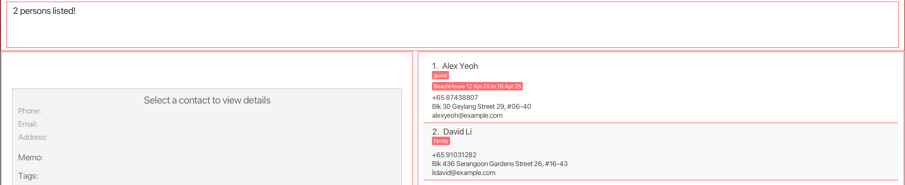

# AB-3 User Guide

AddressBook Level 3 (AB3) is a **desktop app for managing contacts, optimized for use via a  Line Interface** (CLI) while still having the benefits of a Graphical User Interface (GUI). If you can type fast, AB3 can get your contact management tasks done faster than traditional GUI apps.

<!-- * Table of Contents -->
<page-nav-print />

--------------------------------------------------------------------------------------------------------------------

## Quick start

<<<<<<< Updated upstream
1. Ensure you have Java `17` or above installed in your Computer. 
=======
[1. Introduction](#1-introduction)
- [1.1 What is InnSync](#1-1-what-is-innsync)
- [1.2 User Proficiency and Expectations](#1-2-user-proficiency-and-expectations)
- [1.3 Why This Guide Matters](#1-3-why-this-guide-matters)

[2. How to use this User Guide](#2-how-to-use-this-user-guide)
- [2.1 Navigating the Document](#2-1-navigating-the-document)
- [2.2 Sections](#2-2-sections)

[3. Quick start](#3-quick-start)
- [3.1 Installation](#3-1-installation)
- [3.2 Graphical User Interface Layout](#3-2-graphical-user-interface-layout)
    - [3.2.1 User Interface Overview](#3-2-1-user-interface-overview)
    - [3.2.2 Additional UI Components](#3-2-2-other-ui-components)
- [3.3 How to use InnSync features](#3-3-how-to-use-innsync-features)
    - [3.3.1 Parameter Prefixes](#3-3-1-parameter-prefixes)
    - [3.3.2 Parameters](#3-3-2-parameters)
    - [3.3.3 Command Format](#3-3-3-command-format)

[4. Features](#4-features)
- [InnSync User Guide](#innsync-user-guide)
  - [Welcome to the InnSync User Guide](#welcome-to-the-innsync-user-guide)
  - [Table of Contents](#table-of-contents)
  - [1. Introduction](#1-introduction)
    - [1.1 What is InnSync](#11-what-is-innsync)
    - [1.2 User Proficiency and Expectations](#12-user-proficiency-and-expectations)
    - [1.3 Why This Guide Matters](#13-why-this-guide-matters)
  - [2. How to use this User Guide](#2-how-to-use-this-user-guide)
    - [2.1 Navigating the Document:](#21-navigating-the-document)
    - [2.2 Sections:](#22-sections)
  - [3. Quick start](#3-quick-start)
    - [3.1 Installation](#31-installation)
    - [3.2 Graphical User Interface Layout:](#32-graphical-user-interface-layout)
      - [3.2.1 User Interface Overview:](#321-user-interface-overview)
      - [3.2.2 Other UI Components:](#322-other-ui-components)
    - [3.3 How to use InnSync features:](#33-how-to-use-innsync-features)
      - [3.3.1 Parameter Prefixes:](#331-parameter-prefixes)
      - [3.3.2 Parameters:](#332-parameters)
      - [3.3.3 Command Format:](#333-command-format)
  - [4. Features](#4-features)
  - [4.0 Command Summary](#40-command-summary)
  - [4.1 Viewing help : `help`](#41-viewing-help--help)
  - [4.2 Features related to person](#42-features-related-to-person)
    - [4.2.1 Adding a person: `add`](#421-adding-a-person-add)
    - [4.2.2 Editing a person : `edit`](#422-editing-a-person--edit)
    - [4.2.3 Listing all persons : `list`](#423-listing-all-persons--list)
    - [4.2.4 Deleting a person : `delete`](#424-deleting-a-person--delete)
  - [4.3 Features related to star a person](#43-features-related-to-star-a-person)
    - [4.3.1 Star a person : `star`](#431-star-a-person--star)
    - [4.3.2 Unstar a person : `unstar`](#432-unstar-a-person--unstar)
    - [4.3.3 Listing all starred persons : `liststar`](#433-listing-all-starred-persons--liststar)
  - [4.4 Features related to tag a person](#44-features-related-to-tag-a-person)
    - [4.4.1 Adding a booking tag : `tag`](#441-adding-a-booking-tag--tag)
    - [4.4.2 Adding a tag : `tag`](#442-adding-a-tag--tag)
    - [4.4.3 Untagging a booking tag : `untag`](#443-untagging-a-booking-tag--untag)
    - [4.4.4 Untagging a tag : `untag`](#444-untagging-a-tag--untag)
  - [4.5 Features related to finding](#45-features-related-to-finding)
    - [4.5.1 Locating persons: `find`](#451-locating-persons-find)
      - [Search Modes:](#search-modes)
      - [Multiple Field Search:](#multiple-field-search)
      - [Search Behavior:](#search-behavior)
      - [Special Notes for Booking Searches:](#special-notes-for-booking-searches)
      - [Examples:](#examples)
      - [Common Errors and How to Fix Them:](#common-errors-and-how-to-fix-them)
  - [4.6 General features](#46-general-features)
    - [4.6.1 Clearing all entries : `clear`](#461-clearing-all-entries--clear)
    - [4.6.2 Exiting the program : `exit`](#462-exiting-the-program--exit)
    - [4.6.3 Undoing the last change : `undo`](#463-undoing-the-last-change--undo)
    - [4.7 Saving the data](#47-saving-the-data)
    - [4.8 Editing the data file](#48-editing-the-data-file)
  - [5. FAQ](#5-faq)
  - [6. Known issues](#6-known-issues)

[5. FAQ](#5-faq)

[6. Known issues](#6-known-issues)

--------------------------------------------------------------------------------------------------------------------

## 1. Introduction

### 1.1 What is InnSync

InnSync is a desktop application designed specifically for managing contacts for AirBnB owners,
optimized for use via a Command Line Interface** (CLI) while still having the benefits of a
Graphical User Interface (GUI). If you can type fast, InnSync can get your contact management
tasks done faster than traditional GUI apps.

Key Features:
* Contact & Guest Management: Add, edit, and delete contacts with ease.
* Rapid Command Execution: Quickly execute commands using a straightforward CLI.
* Automatic Data Persistence: Your changes are saved automatically to ensure all guest details remain current.

### 1.2 User Proficiency and Expectations
* Technical Skills: InnSync is designed for users with basic command line experience and familiarity with
file navigation.

* Efficiency: Built for Airbnb owners, the tool prioritizes quick, streamlined workflows to manage guest and
contact information.

* User-Friendly: Whether you're new to command line tools or an experienced user, InnSync’s design caters
to a broad range of technical proficiency.

### 1.3 Why This Guide Matters
This guide is crafted to help you fully leverage InnSync’s features. As an Airbnb owner, managing guest details
quickly and accurately is vital. This guide provides clear instructions, examples, and troubleshooting tips so
you can optimize your workflow and focus on delivering a great guest experience.

--------------------------------------------------------------------------------------------------------------------

## 2. How to use this User Guide
This section explains how to navigate the guide and locate the information you need.

### 2.1 Navigating the Document:
* __Table of Contents:__ Use the Table of Contents at the start to jump directly to sections relevant to your needs.
* __Section Organization:__ The guide is divided into clear sections such as Introduction, Quick Start, Features, FAQ, Known Issues, and Command Summary.

### 2.2 Sections:
* [Installation](#31-installation): Step-by-step setup instructions for InnSync.
* [Features](#4-features): Detailed breakdown of each command with usage examples.
* [FAQ & Known Issues](#5-faq): Solutions to common questions and troubleshooting tips.
* [Command Summary](#7-command-summary): A quick-reference table for all available commands.

<box type="info" seamless>
First-time users are strongly encouraged to read the Quick Start section before beginning to use InnSync.
</box>

--------------------------------------------------------------------------------------------------------------------

## 3. Quick start

### 3.1 Installation

1. Ensure you have Java `17` or above installed on your Computer. 
>>>>>>> Stashed changes
   **Mac users:** Ensure you have the precise JDK version prescribed [here](https://se-education.org/guides/tutorials/javaInstallationMac.html).

1. Download the latest `.jar` file from [here](https://github.com/se-edu/addressbook-level3/releases).

1. Copy the file to the folder you want to use as the _home folder_ for your AddressBook.

1. Open a command terminal, `cd` into the folder you put the jar file in, and use the `java -jar addressbook.jar` command to run the application. 
   A GUI similar to the below should appear in a few seconds. Note how the app contains some sample data. 
   

1. Type the command in the command box and press Enter to execute it. e.g. typing **`help`** and pressing Enter will open the help window. 
   Some example commands you can try:

   * `list` : Lists all contacts.

   * `add n/John Doe p/98765432 e/johnd@example.com a/John street, block 123, #01-01` : Adds a contact named `John Doe` to the Address Book.

   * `delete 3` : Deletes the 3rd contact shown in the current list.

   * `clear` : Deletes all contacts.

   * `exit` : Exits the app.

1. Refer to the [Features](#features) below for details of each command.

--------------------------------------------------------------------------------------------------------------------

## Features

<box type="info" seamless>

**Notes about the command format:** 

* Words in `UPPER_CASE` are the parameters to be supplied by the user. 
  e.g. in `add n/NAME`, `NAME` is a parameter which can be used as `add n/John Doe`.

* Items in square brackets are optional. 
  e.g `n/NAME [t/TAG]` can be used as `n/John Doe t/friend` or as `n/John Doe`.

* Items with `…`​ after them can be used multiple times including zero times. 
  e.g. `[t/TAG]…​` can be used as ` ` (i.e. 0 times), `t/friend`, `t/friend t/family` etc.

* Parameters can be in any order. 
  e.g. if the command specifies `n/NAME p/PHONE_NUMBER`, `p/PHONE_NUMBER n/NAME` is also acceptable.

* Extraneous parameters for commands that do not take in parameters (such as `help`, `list`, `exit` and `clear`) will be ignored. 
  e.g. if the command specifies `help 123`, it will be interpreted as `help`.

* If you are using a PDF version of this document, be careful when copying and pasting commands that span multiple lines as space characters surrounding line-breaks may be omitted when copied over to the application.
</box>

<<<<<<< Updated upstream
### Viewing help : `help`
=======
--------------------------------------------------------------------------------------------------------------------

## 4. Features
## 4.0 Command Summary
| Action        | Format, Examples                                                                                                                                                                                                                                                                                                 |
|---------------|------------------------------------------------------------------------------------------------------------------------------------------------------------------------------------------------------------------------------------------------------------------------------------------------------------------|
| **Add**       | `add n/NAME p/PHONE_NUMBER e/EMAIL a/ADDRESS [t/TAG]…​`   e.g., `add n/James Ho p/+82 22224444 e/jamesho@example.com a/123, Clementi Rd, 1234665 t/friend t/colleague`                                                                                                                                         |
| **Tag**       | `tag INDEX r/TAG`   e.g.. `tag 1 b/TAG`  or   `tag INDEX b/<KEYWORD> from/YYYY-MM-DD to/YYYY-MM-DD`   e.g.. `tag 1 b/Hotel from/2025-10-10 to/2025-10-11`                                                                                                                                              |
| **Untag**     | `untag INDEX t/TAG`   e.g., `untag 1 t/TEST` or   `untag INDEX b/{property} {from/} {to/}`   e.g., `untag 1 b/Hotel from/2025-10-10 to/2025-10-11`                                                                                                                                                     |
| **Memo**      | `memo INDEX m/MEMO`   e.g., `memo 1 m/TEST`                                                                                                                                                                                                                                                                  |
| **Star**      | `star INDEX`   e.g., `star 1`                                                                                                                                                                                                                                                                                 |                                                                                                                                                                                                                                                               |
| **Unstar**    | `unstar INDEX`   e.g., `unstar 1`                                                                                                                                                                                                                                                                             |
| **Liststar**  | `liststar`                                                                                                                                                                                                                                                                                                       |
| **Clear**     | `clear`                                                                                                                                                                                                                                                                                                          |
| **Delete**    | `delete INDEX`  e.g., `delete 3`                                                                                                                                                                                                                                                                          |  
| **Edit**      | `edit INDEX [n/NAME] [p/PHONE_NUMBER] [e/EMAIL] [a/ADDRESS] [t/TAG]…​`  e.g.,`edit 2 n/James Lee e/jameslee@example.com`                                                                                                                                                                                   |
| **Find**      | `find KEYWORD [MORE_KEYWORDS]` or `find n/NAME [MORE_NAMES]` or `find p/PHONE [MORE_PHONES]` or `find e/EMAIL [MORE_EMAILS]` or `find a/ADDRESS [MORE_ADDRESSES]` or `find t/TAG [MORE_TAGS]` or `find m/MEMO [MORE_MEMOS]` or `find bd/DATE [MORE_DATES]` or `find bp/PROPERTY [MORE_PROPERTIES]` You can also search across multiple fields at once: `find n/NAME p/PHONE t/TAG ...` Examples: `find James Jake` `find p/9123` `find bd/2025-01-01` `find n/John p/9123 t/VIP` (finds visitors matching any of these criteria) |
| **List**      | `list`                                                                                                                                                                                                                                                                                                           |    
| **Undo**      | `undo`                                                                                                                                                                                                                                                                                                           |    
| **Help**      | `help`                                                                                                                                                                                                                                                                                                           |                                                                                                                                                                                                                                                                                                                  |

## 4.1 Viewing help : `help`
>>>>>>> Stashed changes

Shows a message explaning how to access the help page.

Format: `help`

### Adding a person: `add`

Adds a person to the address book.

Format: `add n/NAME p/PHONE_NUMBER e/EMAIL a/ADDRESS [t/TAG]…​`

<box type="tip" seamless>

**Tip:** A person can have any number of tags (including 0)
</box>

Examples:
* `add n/John Doe p/98765432 e/johnd@example.com a/John street, block 123, #01-01`
* `add n/Betsy Crowe t/friend e/betsycrowe@example.com a/Newgate Prison p/1234567 t/criminal`

### Listing all persons : `list`

Shows a list of all persons in the address book.

Format: `list`

### Editing a person : `edit`

Edits an existing person in the address book.

Format: `edit INDEX [n/NAME] [p/PHONE] [e/EMAIL] [a/ADDRESS] [t/TAG]…​`

* Edits the person at the specified `INDEX`. The index refers to the index number shown in the displayed person list. The index **must be a positive integer** 1, 2, 3, …​
* At least one of the optional fields must be provided.
* Existing values will be updated to the input values.
* When editing tags, the existing tags of the person will be removed i.e adding of tags is not cumulative.
* You can remove all the person’s tags by typing `t/` without
    specifying any tags after it.

Examples:
*  `edit 1 p/91234567 e/johndoe@example.com` Edits the phone number and email address of the 1st person to be `91234567` and `johndoe@example.com` respectively.
*  `edit 2 n/Betsy Crower t/` Edits the name of the 2nd person to be `Betsy Crower` and clears all existing tags.

### Locating visitors: `find`

Allows hosts to search for a visitor by their name, phone, address, email, tags, memos, or booking details. This is useful for quickly finding visitors with specific characteristics or booking preferences.

Format: `find [n/]KEYWORD [MORE_KEYWORDS] | p/KEYWORD [MORE_KEYWORDS] | e/KEYWORD [MORE_KEYWORDS] | a/KEYWORD [MORE_KEYWORDS] | t/KEYWORD [MORE_KEYWORDS] | m/KEYWORD [MORE_KEYWORDS] | bd/DATE [MORE_DATES] | bp/PROPERTY [MORE_KEYWORDS]`

> **Tip:** If you don't include any prefix (like n/, p/, etc.), the search will look through visitor names by default.

#### Search Modes:

| Prefix | Field             | Description                                  | Example                    |
|--------|-------------------|----------------------------------------------|----------------------------|
| (none) or `n/` | Name      | Searches through visitor names              | `find John` or `find n/John` |
| `p/`    | Phone            | Searches through phone numbers               | `find p/9123`              |
| `e/`    | Email            | Searches through email addresses             | `find e/@example.com`      |
| `a/`    | Address          | Searches through home addresses              | `find a/Clementi`          |
| `t/`    | Tag              | Searches through visitor tags (e.g., VIP, frequent)  | `find t/VIP`          |
| `m/`    | Memo             | Searches through host notes about visitors     | `find m/allergies`         |
| `bd/`   | Booking Date     | Searches for visitors with bookings on specific dates | `find bd/2025-01-01` |
| `bp/`   | Booking Property | Searches for visitors with bookings at specific properties | `find bp/BeachHouse` |

#### Multiple Field Search:

You can search across different fields at the same time. The search will show any visitor who matches at least one of your search keywords.

Examples:
* `find n/John a/Clementi` - Finds visitors with "John" in their name or "Clementi" in their address
* `find n/John p/91234567 t/VIP` - Finds visitors with "John" in their name, "91234567" in their phone, or tagged as "VIP"

#### Search Behavior:

* **Default search field**: If no prefix is provided, the search will look through visitor names
* **Not case-sensitive** - Uppercase or lowercase doesn't matter (e.g., `find john` finds `John Doe`)
* **Flexible word order** - The order of keywords doesn't matter (e.g., `find Bo Hans` finds `Hans Bo`)
* **Partial word matching** - Finds matches even with part of a word (e.g., `find Jo` finds `John`)
* **Multiple field matching** - Finds visitors matching any of your search fields (e.g., searching for a name and address will find visitors matching either one)
* **Multiple keyword matching** - When using multiple keywords for the same field, visitors matching any keyword will be found (e.g., `find John Jane` finds visitors with either name)

#### Special Notes for Booking Searches:

* **Booking Dates:** Dates must be in the `yyyy-MM-dd` format (e.g., `2025-01-01` for January 1, 2025)
* **Date Matching:** A visitor is matched if the specified date falls within their booking period
* **Booking Properties:** Searches through property names in booking tags (e.g., "BeachHouse", "MountainCabin")

#### Examples:

**Searching by name:**
* `find John` - Finds visitors with "John" in their name
* `find alex david` - Finds visitors with either "alex" or "david" in their name

**Searching by phone:**
* `find p/9123` - Finds visitors whose phone numbers contain "9123"
* `find p/8765 9123` - Finds visitors whose phone numbers contain either "8765" or "9123"

**Searching by email:**
* `find e/@example.com` - Finds visitors with email addresses containing "@example.com"
* `find e/gmail yahoo` - Finds visitors with email addresses containing either "gmail" or "yahoo"

**Searching by address:**
* `find a/Clementi` - Finds visitors with "Clementi" in their addresses
* `find a/Street Avenue` - Finds visitors with either "Street" or "Avenue" in their addresses

**Searching by tag:**
* `find t/VIP` - Finds visitors tagged as "VIP"
* `find t/family pet-friendly` - Finds visitors tagged as either "family" or "pet-friendly"

**Searching by memo:**
* `find m/breakfast` - Finds visitors with "breakfast" in their memos
* `find m/allergies late-checkout` - Finds visitors with either "allergies" or "late-checkout" in their memos

**Searching by booking date:**
* `find bd/2024-12-25` - Finds visitors with bookings that include December 25, 2024
* `find bd/2025-01-01 2025-02-14` - Finds visitors with bookings that include either January 1, 2025 or February 14, 2025

**Searching by booking property:**
* `find bp/Beach` - Finds visitors with bookings at properties containing "Beach" in the name
* `find bp/House Villa` - Finds visitors with bookings at properties containing either "House" or "Villa"

**Multi-field search examples:**
* `find n/John a/Street` - Finds visitors with either "John" in their name or "Street" in their address
* `find p/9123 e/gmail t/VIP` - Finds visitors with "9123" in their phone, "gmail" in their email, or tagged as "VIP"
* `find n/Alice bd/2025-06-01` - Finds visitors with "Alice" in their name or have a booking on June 1, 2025

#### Common Errors and How to Fix Them:

* **Wrong format**: Double-check you're using the correct prefix for your search type
* **Wrong date format**: Booking dates must be exactly in the `yyyy-MM-dd` format
* **No results**: Try shorter or more general keywords to widen your search
* **Invalid characters**: Make sure your keywords only use allowed characters for each field
* **Missing keyword**: Each search field needs at least one keyword after the prefix
  
### Deleting a person : `delete`

Deletes the specified person from the address book.

Format: `delete INDEX`

* Deletes the person at the specified `INDEX`.
* The index refers to the index number shown in the displayed person list.
* The index **must be a positive integer** 1, 2, 3, …​

Examples:
* `list` followed by `delete 2` deletes the 2nd person in the address book.
* `find Betsy` followed by `delete 1` deletes the 1st person in the results of the `find` command.

<<<<<<< Updated upstream
### Clearing all entries : `clear`
=======
## 4.3 Features related to star a person

### 4.3.1 Star a person : `star`

Stars a person in the address book.

Format: `star INDEX`

### 4.3.2 Unstar a person : `unstar`

Unstar a starred person in the address book.

Format: `unstar INDEX`

### 4.3.3 Listing all starred persons : `liststar`

Shows a list of all starred persons in the address book.

Format: `liststar`

## 4.4 Features related to tag a person

### 4.4.1 Adding a booking tag : `tag`

Adds a booking tag into the person in the address book.

Format: `tag INDEX b/{property} {from/yyyy-MM-dd} {to/yyyy-MM-dd}`

* Adds the booking tag to the person specified by 'INDEX'. The index refers to the index number shown in the displayed person LIST. The index **must be a positive integer**
* All the fields must be provided.
* The date format has to be exactly the same "yyyy-MM-dd".
* When adding a new booking tag the new booking tag will be appended to the previous booking tags if they exist.
* When adding a booking tag for a time interval that has already occurred for the person, it will be rejected.

Examples:
* `tag 1 b/Hotel from/2025-10-10 to/2025-10-11` Adds the booking tag to the 1st person on the list.

### 4.4.2 Adding a tag : `tag`

Adds a tag into the person in the address book.

Format: `tag INDEX t/TAG`

* Adds the tag to the person specified by 'INDEX'. The index refers to the index number shown in the displayed person LIST. The index **must be a positive integer**
* All the fields must be provided.
* When adding a tag the new tag will be appended to the previous tags if they exist.

Examples:
* `tag 1 t/friend` Adds the tag to the 1st person on the list.

### 4.4.3 Untagging a booking tag : `untag`

Removes a booking tag on the 1st person in the address book.

Format: `untag INDEX b/{property} {from/yyyy-MM-dd} {to/yyyy-MM-dd}`

* Removes a booking tag to the person specified by 'INDEX'. The index refers to the index number shown in the displayed person LIST. The index **must be a positive integer**
* All the fields must be provided.
* The date format has to be exactly the same "yyyy-MM-dd".
* When removing a booking tag the booking tag will be removed

Examples:
* `untag 1 b/Hotel from/2025-10-10 to/2025-10-11` Removes the booking tag with matching booking tag on the 1st person in the list.

### 4.4.4 Untagging a tag : `untag`

Removes a tag on the 1st person in the address book.

Format: `untag INDEX t/TAG`

* Removes a tag to the person specified by 'INDEX'. The index refers to the index number shown in the displayed person LIST. The index **must be a positive integer**
* All the fields must be provided.
* When removing a tag the matching tag will be removed

Examples:
* `untag 1 t/friend` Removes the tag with matching tag on the 1st person in the list.

## 4.5 Features related to finding

### 4.5.1 Locating persons: `find`
Allows hosts to search for a visitor by their name, phone, address, email, tags, memos, or booking details. This is useful for quickly finding visitors with specific characteristics or booking preferences.

Format: `find [n/]KEYWORD [MORE_KEYWORDS] | p/KEYWORD [MORE_KEYWORDS] | e/KEYWORD [MORE_KEYWORDS] | a/KEYWORD [MORE_KEYWORDS] | t/KEYWORD [MORE_KEYWORDS] | m/KEYWORD [MORE_KEYWORDS] | bd/DATE [MORE_DATES] | bp/PROPERTY [MORE_KEYWORDS]`

> **Tip:** If you don't include any prefix (like n/, p/, etc.), the search will look through visitor names by default.

#### Search Modes:

| Prefix | Field             | Description                                  | Example                    |
|--------|-------------------|----------------------------------------------|----------------------------|
| (none) or `n/` | Name      | Searches through visitor names              | `find John` or `find n/John` |
| `p/`    | Phone            | Searches through phone numbers               | `find p/9123`              |
| `e/`    | Email            | Searches through email addresses             | `find e/@example.com`      |
| `a/`    | Address          | Searches through home addresses              | `find a/Clementi`          |
| `t/`    | Tag              | Searches through visitor tags (e.g., VIP, frequent)  | `find t/VIP`          |
| `m/`    | Memo             | Searches through host notes about visitors     | `find m/allergies`         |
| `bd/`   | Booking Date     | Searches for visitors with bookings on specific dates | `find bd/2025-01-01` |
| `bp/`   | Booking Property | Searches for visitors with bookings at specific properties | `find bp/BeachHouse` |

#### Multiple Field Search:

You can search across different fields at the same time. The search will show any visitor who matches at least one of your search keywords.

Examples:
* `find n/John a/Clementi` - Finds visitors with "John" in their name or "Clementi" in their address
* `find n/John p/91234567 t/VIP` - Finds visitors with "John" in their name, "91234567" in their phone, or tagged as "VIP"

#### Search Behavior:

* **Default search field**: If no prefix is provided, the search will look through visitor names
* **Not case-sensitive** - Uppercase or lowercase doesn't matter (e.g., `find john` finds `John Doe`)
* **Flexible word order** - The order of keywords doesn't matter (e.g., `find Bo Hans` finds `Hans Bo`)
* **Partial word matching** - Finds matches even with part of a word (e.g., `find Jo` finds `John`)
* **Multiple field matching** - Finds visitors matching any of your search fields (e.g., searching for a name and address will find visitors matching either one)
* **Multiple keyword matching** - When using multiple keywords for the same field, visitors matching any keyword will be found (e.g., `find John Jane` finds visitors with either name)

#### Special Notes for Booking Searches:

* **Booking Dates:** Dates must be in the `yyyy-MM-dd` format (e.g., `2025-01-01` for January 1, 2025)
* **Date Matching:** A visitor is matched if the specified date falls within their booking period
* **Booking Properties:** Searches through property names in booking tags (e.g., "BeachHouse", "MountainCabin")

#### Examples:

**Searching by name:**
* `find John` - Finds visitors with "John" in their name
* `find alex david` - Finds visitors with either "alex" or "david" in their name

**Searching by phone:**
* `find p/9123` - Finds visitors whose phone numbers contain "9123"
* `find p/8765 9123` - Finds visitors whose phone numbers contain either "8765" or "9123"

**Searching by email:**
* `find e/@example.com` - Finds visitors with email addresses containing "@example.com"
* `find e/gmail yahoo` - Finds visitors with email addresses containing either "gmail" or "yahoo"

**Searching by address:**
* `find a/Clementi` - Finds visitors with "Clementi" in their addresses
* `find a/Street Avenue` - Finds visitors with either "Street" or "Avenue" in their addresses

**Searching by tag:**
* `find t/VIP` - Finds visitors tagged as "VIP"
* `find t/family pet-friendly` - Finds visitors tagged as either "family" or "pet-friendly"

**Searching by memo:**
* `find m/breakfast` - Finds visitors with "breakfast" in their memos
* `find m/allergies late-checkout` - Finds visitors with either "allergies" or "late-checkout" in their memos

**Searching by booking date:**
* `find bd/2024-12-25` - Finds visitors with bookings that include December 25, 2024
* `find bd/2025-01-01 2025-02-14` - Finds visitors with bookings that include either January 1, 2025 or February 14, 2025

**Searching by booking property:**
* `find bp/Beach` - Finds visitors with bookings at properties containing "Beach" in the name
* `find bp/House Villa` - Finds visitors with bookings at properties containing either "House" or "Villa"

**Multi-field search examples:**
* `find n/John a/Street` - Finds visitors with either "John" in their name or "Street" in their address
* `find p/9123 e/gmail t/VIP` - Finds visitors with "9123" in their phone, "gmail" in their email, or tagged as "VIP"
* `find n/Alice bd/2025-06-01` - Finds visitors with "Alice" in their name or have a booking on June 1, 2025

#### Common Errors and How to Fix Them:

* **Wrong format**: Double-check you're using the correct prefix for your search type
* **Wrong date format**: Booking dates must be exactly in the `yyyy-MM-dd` format
* **No results**: Try shorter or more general keywords to widen your search
* **Invalid characters**: Make sure your keywords only use allowed characters for each field
* **Missing keyword**: Each search field needs at least one keyword after the prefix

## 4.6 General features

### 4.6.1 Clearing all entries : `clear`
>>>>>>> Stashed changes

Clears all entries from the address book.

Format: `clear`

### Exiting the program : `exit`

Exits the program.

Format: `exit`

### Saving the data

AddressBook data are saved in the hard disk automatically after any command that changes the data. There is no need to save manually.

### Editing the data file

AddressBook data are saved automatically as a JSON file `[JAR file location]/data/addressbook.json`. Advanced users are welcome to update data directly by editing that data file.

<box type="warning" seamless>

**Caution:**
If your changes to the data file makes its format invalid, AddressBook will discard all data and start with an empty data file at the next run.  Hence, it is recommended to take a backup of the file before editing it. 
Furthermore, certain edits can cause the AddressBook to behave in unexpected ways (e.g., if a value entered is outside the acceptable range). Therefore, edit the data file only if you are confident that you can update it correctly.
</box>

### Archiving data files `[coming in v2.0]`

_Details coming soon ..._

--------------------------------------------------------------------------------------------------------------------

## FAQ

**Q**: How do I transfer my data to another Computer? 
**A**: Install the app in the other computer and overwrite the empty data file it creates with the file that contains the data of your previous AddressBook home folder.

--------------------------------------------------------------------------------------------------------------------

## Known issues

1. **When using multiple screens**, if you move the application to a secondary screen, and later switch to using only the primary screen, the GUI will open off-screen. The remedy is to delete the `preferences.json` file created by the application before running the application again.
2. **If you minimize the Help Window** and then run the `help` command (or use the `Help` menu, or the keyboard shortcut `F1`) again, the original Help Window will remain minimized, and no new Help Window will appear. The remedy is to manually restore the minimized Help Window.

--------------------------------------------------------------------------------------------------------------------

## Command summary

<<<<<<< Updated upstream
Action     | Format, Examples
-----------|----------------------------------------------------------------------------------------------------------------------------------------------------------------------
**Add**    | `add n/NAME p/PHONE_NUMBER e/EMAIL a/ADDRESS [t/TAG]…`   e.g., `add n/James Ho p/22224444 e/jamesho@example.com a/123, Clementi Rd, 1234665 t/friend t/colleague`
**Clear**  | `clear`
**Delete** | `delete INDEX`  e.g., `delete 3`
**Edit**   | `edit INDEX [n/NAME] [p/PHONE_NUMBER] [e/EMAIL] [a/ADDRESS] [t/TAG]…`  e.g.,`edit 2 n/James Lee e/jameslee@example.com`
**Find**   | `find [n/]KEYWORD [MORE_KEYWORDS] | p/KEYWORD [MORE_KEYWORDS] | e/KEYWORD [MORE_KEYWORDS] | a/KEYWORD [MORE_KEYWORDS] | t/KEYWORD [MORE_KEYWORDS] | m/KEYWORD [MORE_KEYWORDS] | bd/DATE [MORE_DATES] | bp/PROPERTY [MORE_KEYWORDS]`  e.g., `find James Jake` or `find p/9123 t/VIP`
**List**   | `list`
**Help**   | `help`
=======

>>>>>>> Stashed changes
